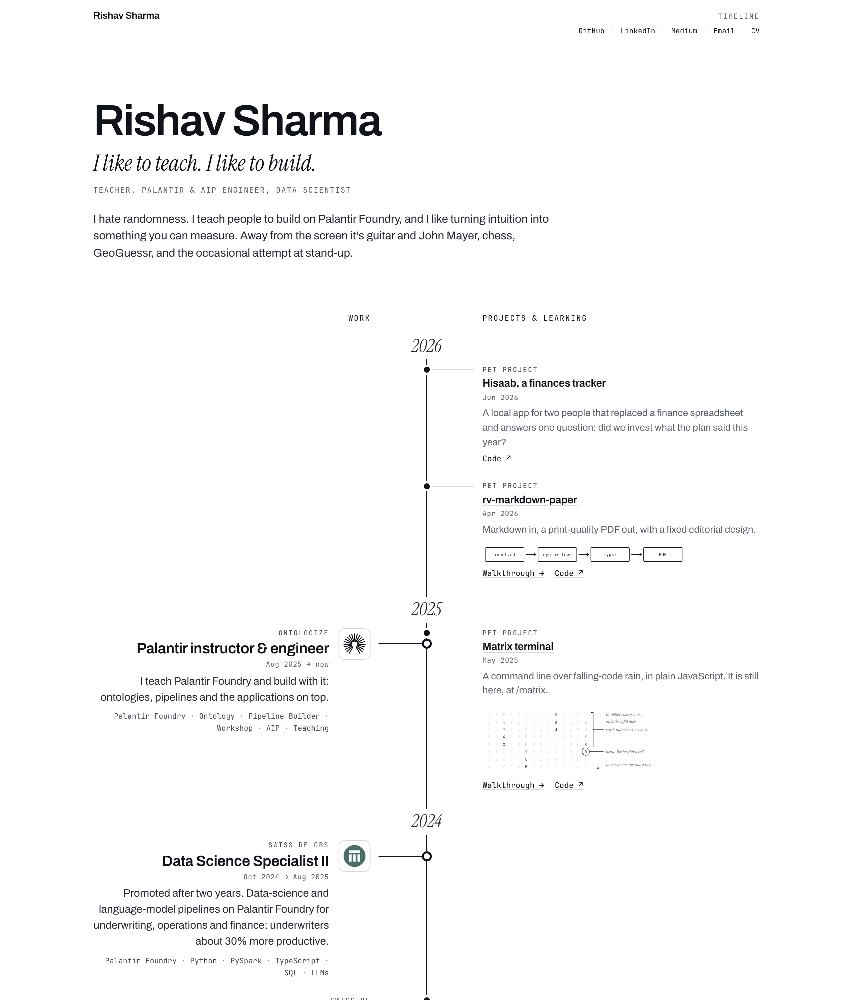

# rv-portfolio-matrix

My personal site, [rvs23.dev](https://rvs23.dev/): a plain timeline of work, study and projects, year by year, with walkthroughs for the projects worth explaining.



## How it reads

One line of years runs down the middle of the page. Work hangs on its left; projects and learning hang on its right, so what happened in the same year sits side by side. A role or a degree gets a logo, a larger title and a ring on the line. Everything else is a dot and a line of text, with a small drawing where there is one.

A project with more to say links to a walkthrough: a page of its own, written in Markdown, with hand-drawn SVG figures that draw themselves in as you scroll.

## How it is made

The page is static HTML, generated at build time from a handful of files:

```
content/
  timeline.json         The header, the links, and every dated entry
  projects/             One Markdown walkthrough per project page
  notes/                Dated notes (none yet)
  figures/  logos/      SVG figures and organisation logos
paper/                  The code: content loader, Markdown, templates,
                        styles, fonts, and the Vite plugin that builds it
```

There is no framework, no backend and no tracking, and the page makes no third-party requests. It is set in Archivo, Instrument Serif and JetBrains Mono, as in [rv-markdown-paper](https://github.com/rvs-23/rv-markdown-paper).

## Docs

- [docs/timeline.md](docs/timeline.md): add an entry, write a walkthrough, draw a figure, and how a page is generated.
- [docs/development.md](docs/development.md): setup, commands, tests, release modes and deployment.

Licensed under the [MIT License](LICENSE).

<sub>There is [another door](docs/matrix.md).</sub>
