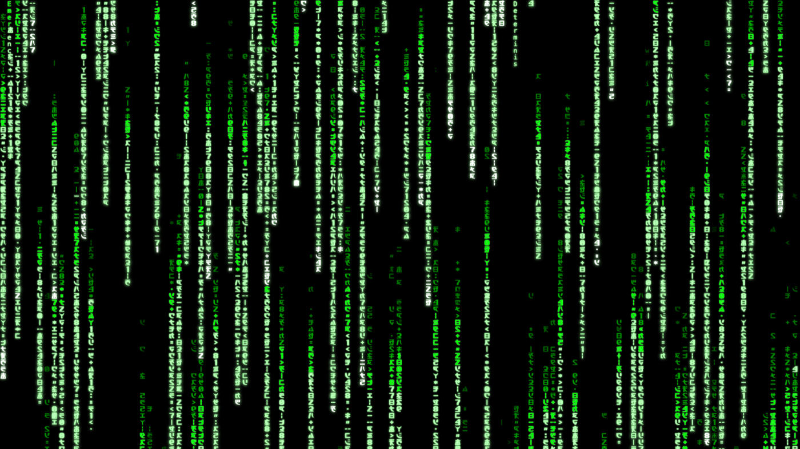

# Matrix Terminal Portfolio

A personal portfolio built as a Matrix-themed command line: type commands to
read the profile, and a full-screen digital-rain animation runs behind it.

Live: [rvs23.dev](https://rvs23.dev/)



## Quick start

Needs [Node.js](https://nodejs.org/) 18 or newer (for the Vite dev server and build).

```bash
npm install      # install dev dependencies
npm run dev      # start the local dev server (http://localhost:5173)
npm run build    # produce a static site in dist/
npm test         # contract smoke test (registry, man pages, help, rain.json)
npm run lint     # ESLint, incl. the floating-promise check
```

The site itself is plain HTML, CSS, and JavaScript. Vite only provides the dev
server and the production bundle; there is no framework to learn.

## Try these

Once the terminal is open, type any of these and press Enter:

| Command      | What it does                                          |
| ------------ | ----------------------------------------------------- |
| `whoami`     | Print the profile: identity, brief, links.            |
| `skills`     | List key skills (use `skilltree` to drill in).        |
| `rain`       | Show rain settings; subcommands tune the animation.   |
| `theme`      | Switch the color scheme (e.g. `theme amber`).         |
| `screenshot` | Save the current rain frame as a PNG wallpaper.       |
| `help`       | List every command.                                   |

`help` lists all commands, and `man <command>` prints its full manual. Those two
are the complete in-terminal reference.

## Repo map

```
index.html              Page shell: loader, canvas, terminal, nav
css/
  style.css             Layout, the glass terminal, media queries, reduced-motion
  themes.css            One CSS-variable set per color theme
js/
  main.js               Boot: load data, build context, start terminal + rain
  commands/0_index.js   Registry mapping every command name to its module
  controller/           Terminal DOM, input, output, history, theming
  rain/engine.js        The digital-rain animation (canvas, self-contained)
public/config/
  rain.json             Rain defaults, glyphs, presets, validation rules
  content/              Data that drives commands (skills, hobbies, man pages)
```

## Rain parameters

The rain reads its defaults from `public/config/rain.json` (`defaultConfig`).
Each preset carries its own full set of these keys (no inheritance from the
defaults); the same ranges apply.

| Key                 | Type / range          | Effect                                                 |
| ------------------- | --------------------- | ------------------------------------------------------ |
| `speed`             | int 10–500 (ms/frame) | Time between drops falling one row; lower = faster.    |
| `font`              | int 8–40 (px)         | Glyph size, which also sets column width.              |
| `lineH`             | float 0.5–2           | Row-height multiplier.                                 |
| `density`           | float 0.1–2           | Fraction of columns that carry rain.                   |
| `minTrail`          | int 1–150             | Shortest trail length for a stream.                    |
| `maxTrail`          | int 1–150             | Longest trail length.                                  |
| `headGlowMin`       | int 0–20              | Fewest glowing cells behind a head.                    |
| `headGlowMax`       | int 0–20              | Most glowing cells behind a head.                      |
| `blur`              | int 0–20 (px)         | Per-glyph glow radius.                                 |
| `bloomRadius`       | int 0–30 (px)         | Blur radius of the full-screen bloom pass.             |
| `bloomIntensity`    | float 0–1             | Strength of the bloom layer (0 = off).                 |
| `decayBase`         | float 0.7–0.99        | Trail fade rate; lower fades quicker.                  |
| `layers`            | int 1–10              | Number of depth (opacity) layers.                      |
| `layerOp`           | float[] 0–1           | Opacity per layer (≥0.85 = white heads); length = `layers`. |
| `delChance`         | float 0–1             | Fraction of streams that erase instead of draw.        |
| `multiStream`       | float 0–0.8           | Chance a column runs a second stream.                  |
| `highlightChance`   | float 0–1             | Fraction of heads that stammer (pause in unison).      |
| `glyphSyncInterval` | int 1–60 (frames)     | Frames between globally synced glyph changes.          |
| `mutationChance`    | float 0–1             | Per-cell chance to change glyph on a sync frame.       |
| `stammerInterval`   | int 10–500 (frames)   | Frames between head-stammer pauses.                    |
| `headFlickerInterval` | int 1–30 (frames)   | Frames between head-glyph changes; lower = faster.     |
| `landingGlow`       | float 0–1             | Glow burst when a stream exits the bottom (0 = off).   |
| `landingGlowSize`   | int 10–200 (px)       | Radius of the landing-glow burst.                      |
| `dimFloor`          | float 0–0.1           | Minimum brightness cells decay toward (0 = true black).|
| `sentientChance`    | float 0–0.5           | Chance a stream spells a hidden phrase.                |
| `minStreamGap`      | int 0–40 (rows)       | Extra spacing before a column's second stream restarts.|
| `gravityAccel`      | float 0–1             | Downward acceleration near the bottom; set via `rain gravity`. |

Reduced motion: with the browser's "reduce motion" setting on, the rain paints
one static frame instead of animating.

## Learn from this repo

This project doubles as a worked example of a browser app with no framework. The
[`primer/`](primer/) folder walks through it for someone who knows basic
programming but is new to the web: [part 1](primer/01-the-page-and-its-skin.md)
covers the HTML page and its CSS skin, and
[part 2](primer/02-the-terminal-and-the-rain.md) covers the JavaScript that runs
the terminal and the rain.

## Credits

Glyph fonts and inspiration from [Rezmason/matrix](https://github.com/Rezmason/matrix/tree/master).
Rain behavior draws on [Carl Newton's digital rain analysis](https://carlnewton.github.io/digital-rain-analysis/).

Licensed under the [MIT License](LICENSE).
