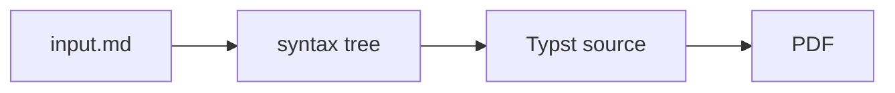

## Why

Markdown is pleasant to write, but turning it into a PDF usually gives you a printed web page or a LaTeX project. A printed page has the wrong margins and no running headers; LaTeX asks you to stop writing Markdown.

rv-markdown-paper keeps the Markdown and sets it in a fixed editorial design: a cover page, running headers, page numbers, margin notes, footnotes, callouts, figures and tables. The author writes; the template decides how it looks.

## How it works



1. **Parse.** `remark` turns the Markdown into a syntax tree, with a few extensions: `:::` blocks for margin notes and callouts, `{#id .class}` attributes, maths and definition lists.
2. **Generate.** Each node becomes Typst markup. Anything the design can't render, such as raw HTML or a remote image, is rejected with a clear error rather than dropped.
3. **Compile.** Typst typesets the page with fonts bundled in the repo, so the same file gives the same PDF on every machine.

## Using it

```bash
npm run mdpdf -- notes.md notes.pdf --paper-bg platinum --author "Rv"
```

Settings can also sit at the top of the Markdown file, so a document carries its own look. This page borrows its palette and fonts.
