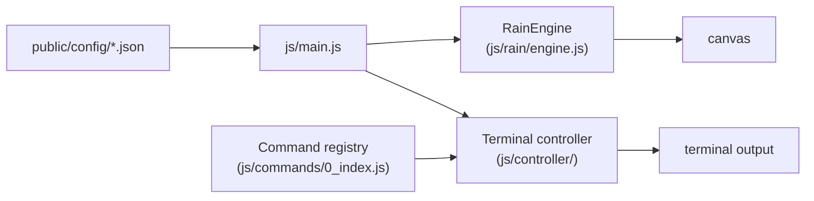

# The Matrix terminal

The other face of [rvs23.dev](https://rvs23.dev/matrix/). The timeline's navigation never points here; only the project entry that describes it does. You found the door.


The page at `/matrix/`: a command line over the digital rain. This covers how to use it, how it is built, and how to change it. For a slower, teaching walk through the same code, read the [primer](primer/01-the-page-and-its-skin.md).

## Contents

- [At a glance](#at-a-glance)
- [Commands](#commands)
- [How it starts](#how-it-starts)
- [Add a command](#add-a-command)
- [Change what a command says](#change-what-a-command-says)
- [Themes](#themes)
- [The rain](#the-rain)
- [Rain parameters](#rain-parameters)
- [Where to change what](#where-to-change-what)
- [Gotchas](#gotchas)
- [Credits](#credits)

## At a glance

[`matrix/index.html`](../matrix/index.html) is the whole page: a loading screen, a full-screen canvas, a terminal window and a row of links. [`js/main.js`](../js/main.js) loads the data, starts the rain on the canvas and hands the terminal a table of commands. Typing a name runs the matching function, which prints HTML into the terminal.



## Commands

Type `help` for the list and `man <command>` for a command's manual. Those two are the full reference; this table is a starting point.

| Command | What it does |
|---|---|
| `whoami` | Print the profile: identity, brief, links. |
| `skills`, `skilltree [path]` | List skills, or walk the tree. |
| `about`, `notes` | Link to the timeline and list its notes. |
| `theme <name>` | Switch the colour scheme. |
| `rain <subcommand>` | Tune the rain: preset, font, size, gravity and more. |
| `term <subcommand>` | Terminal opacity, font size and window size. |
| `search [keyword]`, `ask <question>` | Find a command by keyword or plain English. |
| `screenshot` | Save the current rain frame as a PNG. |
| `reset` | Put every preference back to default. |

`/matrix/?cmd=<name>` runs one command on load. Only a registered command with no arguments is accepted, so a shared link cannot inject anything. Theme and rain preset are remembered in `localStorage`.

A few commands are hidden: they work when typed in full but are left out of `help`, tab completion and "did you mean".

## How it starts

1. `main.js` fetches `rain.json`, `skills.json`, `hobbies.json` and `manPages.json` from `public/config/`, and `paper.json` if the timeline was built.
2. It builds one **context** object (the data, the config, the terminal's output functions, the rain engine) that every command receives.
3. It waits for the fonts and a minimum loader time, starts the rain behind the loader, then fades the loader out onto rain that is already falling.
4. The terminal controller takes over the input line: history, tab completion, and running commands.

## Add a command

1. **Write it.** Create `js/commands/<name>.js` with a default export that takes `(args, context)` and prints with `context.appendToTerminal(html)`.

   ```js
   export default function pingCommand(_args, context) {
     context.appendToTerminal("<div>pong</div>");
   }
   ```

2. **Register it.** Import it in [`js/commands/0_index.js`](../js/commands/0_index.js) and add it to the object `getAllCommands` returns.
3. **List it.** Add a line to `help.commandList` in [`js/config/index.js`](../js/config/index.js).
4. **Document it.** Add a manual entry to [`public/config/content/manPages.json`](../public/config/content/manPages.json).

`npm test` fails until steps 2 to 4 agree: every visible command needs a help line and a man page, and neither may name a command that does not exist. A command meant to stay secret goes in `HIDDEN_COMMANDS` instead of `help`.

Escape anything that came from data or from the visitor with `escapeHtml` from `js/utils.js` before printing it.

## Change what a command says

Most text is data, not code:

| What | Where |
|---|---|
| Skills and the skill tree | `public/config/content/skills.json` |
| Hobbies | `public/config/content/hobbies.json` |
| Manual pages | `public/config/content/manPages.json` |
| Profile, contact, help text, messages | `js/config/index.js` |

## Themes

A theme is a set of CSS variables. To add one, add it to the `themes` registry in `js/config/index.js` and write a matching `body.theme-<name>` block in [`css/themes.css`](../css/themes.css). A test checks that every registered theme has its block. The rain reads its colours from the same variables, so it follows the theme.

## The rain

[`js/rain/engine.js`](../js/rain/engine.js) is self-contained and knows nothing about the terminal. It does not move letters down the screen. It keeps a fixed grid of glyphs, each with a brightness, and moves *light* down the columns: a stream sets the cell under it to full brightness, and every cell fades a little each frame, which leaves the trail. A few cells change their glyph on the same frame, which gives the shimmer. [Primer part 2](primer/02-the-terminal-and-the-rain.md) explains this step by step.

With the browser's "reduce motion" setting on, the rain paints one still frame instead of animating.

## Rain parameters

The rain reads its defaults from [`public/config/rain.json`](../public/config/rain.json) (`defaultConfig`). Each preset carries its own full set of these keys, with no inheritance from the defaults; the same ranges apply.

| Key                 | Type / range          | Effect                                                 |
| ------------------- | --------------------- | ------------------------------------------------------ |
| `speed`             | int 10–500 (ms/frame) | Time between drops falling one row; lower = faster.    |
| `font`              | int 8–40 (px)         | Glyph size, which also sets column width.              |
| `lineH`             | float 0.5–2           | Row-height multiplier.                                 |
| `density`           | float 0.1–2           | Fraction of columns that carry rain.                   |
| `minTrail`          | int 1–150             | Shortest trail length for a stream.                    |
| `maxTrail`          | int 1–150             | Longest trail length.                                  |
| `headGlowMin`       | int 0–20              | Fewest glowing cells behind a head.                    |
| `headGlowMax`       | int 0–20              | Most glowing cells behind a head.                      |
| `blur`              | int 0–20 (px)         | Per-glyph glow radius.                                 |
| `bloomRadius`       | int 0–30 (px)         | Blur radius of the full-screen bloom pass.             |
| `bloomIntensity`    | float 0–1             | Strength of the bloom layer (0 = off).                 |
| `decayBase`         | float 0.7–0.99        | Trail fade rate; lower fades quicker.                  |
| `layers`            | int 1–10              | Number of depth (opacity) layers.                      |
| `layerOp`           | float[] 0–1           | Opacity per layer (≥0.85 = white heads); length = `layers`. |
| `delChance`         | float 0–1             | Fraction of streams that erase instead of draw.        |
| `multiStream`       | float 0–0.8           | Chance a column runs a second stream.                  |
| `highlightChance`   | float 0–1             | Fraction of heads that stammer (pause in unison).      |
| `glyphSyncInterval` | int 1–60 (frames)     | Frames between globally synced glyph changes.          |
| `mutationChance`    | float 0–1             | Per-cell chance to change glyph on a sync frame.       |
| `stammerInterval`   | int 10–500 (frames)   | Frames between head-stammer pauses.                    |
| `headFlickerInterval` | int 1–30 (frames)   | Frames between head-glyph changes; lower = faster.     |
| `landingGlow`       | float 0–1             | Glow burst when a stream exits the bottom (0 = off).   |
| `landingGlowSize`   | int 10–200 (px)       | Radius of the landing-glow burst.                      |
| `dimFloor`          | float 0–0.1           | Minimum brightness cells decay toward (0 = true black).|
| `sentientChance`    | float 0–0.5           | Chance a stream spells a hidden phrase.                |
| `minStreamGap`      | int 0–40 (rows)       | Extra spacing before a column's second stream restarts.|
| `gravityAccel`      | float 0–1             | Downward acceleration near the bottom; set via `rain gravity`. |

## Where to change what

| To change | Edit |
|---|---|
| The page's structure | `matrix/index.html` |
| Layout, the glass terminal, breakpoints | `css/style.css` |
| A colour theme | `css/themes.css` and the registry in `js/config/index.js` |
| Input, history, completion, output | `js/controller/terminalController.js` |
| Keyboard shortcuts | `js/controller/shortcuts.js` |
| Rain defaults, presets, glyph sets | `public/config/rain.json` |
| How the rain draws | `js/rain/engine.js` |

## Gotchas

- **Every path in the page is absolute** (`/js/main.js`, `/css/style.css`), so the page works from `/matrix/` while its code stays at the repo root.
- **A preset must carry every tunable key.** The engine rejects a preset with one missing, and a test catches it first.
- **Look up typed keys with `own()`** from `js/utils.js`, never plain `obj[key]`, so input like `constructor` cannot reach the prototype chain.
- **Old links still work.** `/?cmd=…` on the home page forwards to `/matrix/?cmd=…`, and retired `/recruiter` links go home.

## Credits

Glyph fonts and inspiration from [Rezmason/matrix](https://github.com/Rezmason/matrix/tree/master). Rain behaviour draws on [Carl Newton's digital rain analysis](https://carlnewton.github.io/digital-rain-analysis/).
