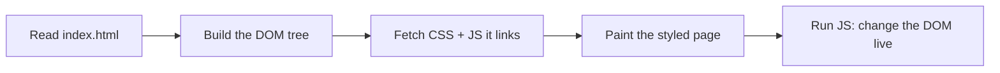

# Part 1: The page and its skin (HTML and CSS)

This primer assumes you can already write a small program (say, in Python), but
that HTML, CSS, and the browser are new to you. We build up in three passes:
read the page, understand how CSS styles it, then change something yourself.

## What a browser does with an HTML file

When you open a web page, the browser reads one HTML file top to bottom. HTML is
not a programming language; it is a tree of nested *elements* (tags like
`<div>`) that describe the content. The browser turns that text into a live
in-memory tree called the **DOM** (Document Object Model). Each element becomes
a node you can later find and change from JavaScript.

While reading, the browser also fetches the files the HTML points at: stylesheets
(CSS, which controls appearance) and scripts (JavaScript, which adds behavior).
CSS paints the tree; JavaScript manipulates it.



That is the whole model. Now let us read this repo's one HTML file.

## Reading index.html, top to bottom

Open `index.html`. It is short (about 140 lines). Everything the visitor sees
starts here.

### The head: metadata, not content

Find the `<head>` block near the top. Nothing in `<head>` is drawn on screen; it
holds information *about* the page. Two kinds matter here.

First, the `<link>` tags load CSS files and fonts. Find these:

```html
<link rel="stylesheet" href="/css/style.css" />
<link rel="stylesheet" href="/css/themes.css" />
```

Those two lines are why the page has any appearance at all. We read both files
below.

Second, find the `og:` tags:

```html
<meta property="og:title" content="Rv's Matrix Terminal Portfolio" />
<meta property="og:image" content="https://rvs23.dev/favicon/rv-matrix-style-favicon-1.png" />
```

`og:` is the Open Graph protocol. When someone pastes the site's URL into Slack,
WhatsApp, or a social feed, that app reads these tags to build the little preview
card (title, description, thumbnail). They do nothing for a visitor who is already
on the page; they exist for the *scrapers* that generate link previews. Note the
comment above them: the image URL must be absolute (start with `https://`),
because a scraper on another server cannot resolve a relative path.

### The body: what actually shows

The `<body>` holds the visible content. Read its direct children in order; each
is one layer of the page.

1. **The loader.** Find `<div id="loading-screen">`. This is the "INITIALIZING..."
   screen shown first. JavaScript hides it once the page is ready. An `id` is a
   unique name for one element, so code can find it with
   `document.getElementById("loading-screen")`.

2. **The canvas.** Find `<canvas id="matrix-canvas"></canvas>`. A `<canvas>` is a
   blank rectangle that JavaScript can draw pixels onto. It is empty in the HTML
   on purpose: the rain is painted frame by frame from code (part 2). This is the
   full-screen background.

3. **The terminal.** Find `<div id="contentContainer" class="content-container">`.
   This is the glass panel in the middle. Inside it, in order: a title bar with
   three dots, a `<pre id="terminal-output">` where command output is printed, a
   row of quick-command chips, and a `<div class="prompt-line">` holding the `$`
   and the text `<input>` you type into. A `class` (unlike an `id`) can be shared
   by many elements and is mainly used by CSS to style groups.

4. **The nav.** Find `<nav class="minimal-nav">`. This is the row of icons at the
   bottom (terminal toggle, LinkedIn, GitHub, email, CV). Each is an `<a>`
   (a link) with an empty `href="#"`; JavaScript fills in the real URLs at
   startup, so the profile links live in one config file rather than in the HTML.

At the very bottom, find:

```html
<script type="module" src="/js/main.js"></script>
```

That one line loads the JavaScript. `type="module"` means the file may `import`
other files (part 2 explains modules). It sits last so the DOM above it already
exists when the script runs.

You have now read the entire structure. Everything else is appearance (CSS) and
behavior (JS).

## CSS: styling as a list of rules

A CSS file is a flat list of **rules**. Each rule has a *selector* (which
elements it targets) and a block of *declarations* (what to change). One example:

```css
.prompt-arrow {          /* selector: every element with class "prompt-arrow" */
  color: var(--primary-color);   /* declaration: property + value */
  font-weight: bold;
}
```

Selectors can target a tag (`body`), a class (`.nav-icon`, note the dot), or an
id (`#matrix-canvas`, note the hash). When two rules set the same property on the
same element, the browser resolves the conflict by **specificity** (an id beats a
class beats a tag) and, for equal specificity, by source order (later wins). That
tie-breaking is called the *cascade*, the C in CSS. You rarely think about it
until two rules fight; then it is the first thing to check.

## A guided tour of style.css

Open `css/style.css`. It is long, but you only need five ideas from it.

### Custom properties (theme variables)

At the very top, find the `:root { ... }` block. `:root` is the whole document.
The lines inside that start with `--` are **custom properties** (CSS variables):

```css
:root {
  --primary-color: #0f0;
  --terminal-opacity: 0.55;
  --terminal-font-size: 12.5px;
}
```

Anywhere later, `var(--primary-color)` reads that value. Define the color once,
use it in fifty places, change it in one. This is the hinge the whole theming
system turns on, as the next file shows.

### The glass terminal

Find the `.content-container` rule (around line 177). Two declarations give the
terminal its frosted-glass look:

```css
background-color: rgba(var(--terminal-base-r), ..., var(--terminal-opacity));
backdrop-filter: blur(18px) saturate(1.4);
```

`background-color` with an alpha below 1 makes the panel semi-transparent.
`backdrop-filter: blur(...)` then blurs *whatever is behind* the panel, which is
the rain. Together they turn a flat translucent box into glass with light bending
through it.

### Positioning: the full-screen canvas

Find `#matrix-canvas` (around line 140):

```css
#matrix-canvas {
  position: fixed;
  top: 0; left: 0;
  width: 100%; height: 100%;
  pointer-events: none;
  z-index: 3;
}
```

`position: fixed` pins the element to the viewport, so it fills the screen and
ignores scrolling. `pointer-events: none` lets clicks pass *through* the canvas
to the terminal underneath. `z-index` is stacking order: higher sits on top. The
canvas is 3, the terminal is 10, the nav is 150, the loader is 200, so the loader
covers everything and the rain sits behind the terminal.

### Centering with flexbox

Find the `body` rule. These three lines center the terminal on screen:

```css
display: flex;
align-items: center;      /* center vertically */
justify-content: center;  /* center horizontally */
```

Flexbox is the standard way to lay out a row or column of items. Here the body
has one main child to place (the terminal), and flexbox parks it dead center
without any manual math.

### Media queries: adapting to small screens

Near the bottom, find `@media (max-width: 767px) { ... }`. A **media query** is a
block of CSS that only applies when a condition holds, here "screen is 767px wide
or less" (a phone). Inside, `.content-container` is given a wider `90vw` and a
shorter height so the terminal fits a narrow portrait screen. The rest of the
file is the shared baseline; this block is the phone-only override.

## themes.css: the entire theming system

Open `css/themes.css`. This is where the payoff of custom properties lands.

At the top, one rule targets *any* body whose class contains `theme-`:

```css
body[class*="theme-"] {
  --text-shadow-color: rgba(var(--primary-color-rgb), 0.7);
  --border-color: rgba(var(--primary-color-rgb), 0.6);
  /* ...more derived colors... */
}
```

It derives shadows, borders, and scrollbars from one base color, so a theme only
has to declare a handful of core colors. Each theme is then one small block:

```css
body.theme-green {
  --primary-color: #0f0;
  --primary-color-rgb: 0, 255, 0;
  --secondary-color: #00ffff;
  --matrix-rain-glow-color: #9fff9f;
  --background-color: #000;
  --terminal-base-r: 17;
  --terminal-base-g: 24;
  --terminal-base-b: 39;
}
```

That is the whole theming engine: switching themes just swaps which
`body.theme-*` class is on `<body>`, which swaps this variable set, and every
`var(--...)` across both stylesheets re-reads the new values. The `theme` command
(part 2) does exactly one thing to repaint the page: change that class.

## Two war stories from this repo

Real code carries the scars of bugs that got fixed. Two live in the CSS above.

### 100vh vs 100dvh and the mobile keyboard

In the `body` rule you will see height set twice:

```css
height: 100vh;
/* dvh tracks the *visible* viewport, so the on-screen keyboard shrinks the
   layout instead of shoving the centred terminal (and its input) off-screen. */
height: 100dvh;
```

`vh` is 1% of the viewport height. The problem: on phones, `100vh` counts the
*full* screen and ignores the browser's address bar and the on-screen keyboard.
When the keyboard slid up to type a command, it covered the input, because the
layout still thought it had the whole screen. `dvh` (dynamic viewport height)
tracks the *currently visible* area instead, so the terminal shrinks to fit the
space above the keyboard. Setting `100vh` first and `100dvh` second is graceful
fallback: browsers that do not understand `dvh` keep the first line; the rest use
the second. The canvas rule does the same thing for the same reason.

### Reduced motion: from black page to a still frame

Some people set an operating-system preference to reduce motion, because
animation can cause nausea or distraction. The browser exposes it to CSS as
`@media (prefers-reduced-motion: reduce)`. Find that block near the bottom of
`style.css`: it switches off the blinking prompt, the CRT flicker, the hover
glitch, and the loading spinner.

The rain is the interesting part. An earlier version simply hid the canvas for
these users, which left a stark black page. The current design instead paints
*one* static frame of rain and never animates it (the switch lives in the rain
engine, covered in part 2). Same respect for the setting, far less jarring
result: a frozen Matrix still, not a void.

## Exercises

Hints only. Each is small and lives in the files above.

1. **Add a 12th theme.** Copy one `body.theme-*` block in `themes.css`, rename the
   class, and pick new colors. For the `theme` command to accept the name, it
   must also be listed where the command validates themes (`availableThemes` in
   `js/config/index.js`, revisited in part 2). Which variables must a theme set
   for the rain color to change too?

2. **Change the terminal's default size.** The panel's starting width and height
   come from a config value, not from `style.css` (the stylesheet only caps the
   maximum with `max-width` / `max-height`). Find `terminal.defaultSize` in
   `js/config/index.js` and adjust it. Why does resizing the browser not break
   the layout?

3. **Make the nav labels always visible.** Right now each `.nav-label` is hidden
   (`opacity: 0`) until you hover its icon (`.nav-icon:hover .nav-label`). Change
   the default so labels always show. What happens to the spacing of the nav row,
   and which rule would you touch to fix it?

Next: [Part 2: the terminal and the rain](02-the-terminal-and-the-rain.md),
where the JavaScript brings all of this to life.
