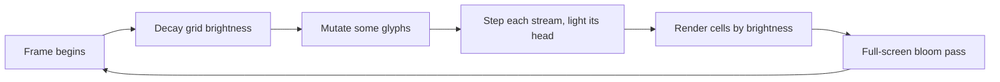
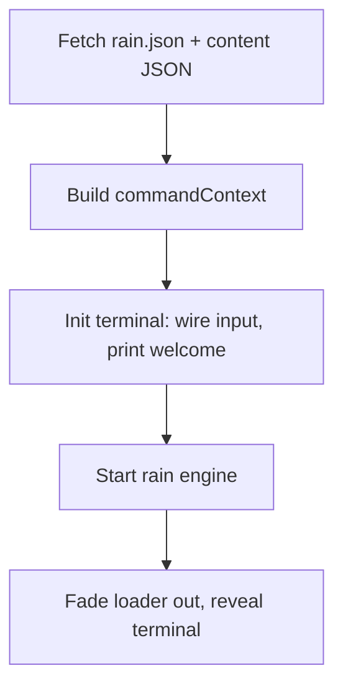

# Part 2: The terminal and the rain (JavaScript)

[Part 1](01-the-page-and-its-skin.md) covered the static page and its CSS. This
part covers the JavaScript that reads your keystrokes, runs commands, and paints
the rain. It assumes you can program but are new to the browser.

## ES modules: the js/ tree as a map

The code is split into small files called **modules**. A module uses `export` to
publish a value and `import` to pull one in from another file, so each file names
exactly what it depends on. From `main.js`:

```js
import RainEngine from "./rain/engine.js";
import { getAllCommands } from "./commands/0_index.js";
```

`export default` publishes one main thing per file (imported without braces, like
`RainEngine`); named exports publish several (imported in braces, like
`{ getAllCommands }`). Here is the layout, grouped by job:

```
js/
  main.js                     Entry point: boots everything (below)
  config/index.js             Static config: user details, themes, terminal sizes
  utils.js                    Small shared helpers (tree render, fuzzy match)
  controller/
    dataLoader.js             Fetches the JSON files at startup
    terminalController.js     Input, output, history, autocomplete, theming
    loaderScreen.js           The "INITIALIZING..." screen
    shortcuts.js              Ctrl+\ and the Konami code
  commands/
    0_index.js                Registry: every command name -> its module
    whoami.js, theme.js, ...  One file per command
  rain/
    engine.js                 The digital-rain animation
```

The `0_` prefix on `0_index.js` is just a convention to sort the registry to the
top of the folder.

## Events and the DOM: from keystroke to screen

The browser fires **events** when things happen: a key press, a click, a resize.
You react by registering a listener with `addEventListener`. Open
`terminalController.js` and follow one command from keypress to output.

The input box gets a keydown listener when the terminal starts:

```js
state.elements.input.addEventListener("keydown", handleCommandInputKeydown);
```

Inside `handleCommandInputKeydown`, the Enter branch reads what you typed, clears
the box, and hands off:

```js
if (e.key === "Enter") {
  const fullCommandText = state.elements.input.value.trim();
  state.elements.input.value = "";
  submitCommand(fullCommandText);
}
```

`submitCommand` echoes your line back into the terminal, then calls
`processCommand`, which splits the text into a command name and arguments, looks
the name up, and calls it (trimmed here for clarity):

```js
const commandName = parts[0].toLowerCase();
const args = parts.slice(1);
const commandFunc = Object.hasOwn(state.commands, commandName)
  ? state.commands[commandName]
  : undefined;
if (typeof commandFunc === "function") {
  commandFunc(args, commandContext);
}
```

The `Object.hasOwn` guard rejects names like `constructor` that exist on every
JavaScript object but were never registered as commands.

Every command finally prints by calling `appendToTerminal`, which is the one
function that touches the output DOM:

```js
export function appendToTerminal(htmlContent, type = "output-text-wrapper") {
  const lineDiv = document.createElement("div");
  lineDiv.classList.add(type);
  lineDiv.innerHTML = htmlContent;                       // put HTML into the page
  state.elements.output.appendChild(lineDiv);            // attach it to the DOM
  state.elements.output.scrollTop = state.elements.output.scrollHeight;
}
```

`document.createElement` makes a new node; `appendChild` inserts it into the live
tree; the browser repaints. That is the full round trip: **keydown → dispatch →
appendToTerminal → visible output**. Nothing else in the app writes to the
terminal.

## The command registry: adding a command touches one object

Here is the design idea worth stealing from this repo. Every command is a plain
function with the same shape:

```js
export default function themeCommand(args, context) {
  const { appendToTerminal } = context;
  // ...do the work...
  appendToTerminal("<div class='output-success'>Theme set to green.</div>");
}
```

`args` is the words you typed after the command name; `context` is a bag of
everything a command might need (the config, the data, `appendToTerminal`, the
rain engine, and so on), assembled once at startup in `main.js`.

All commands are collected in one place, `commands/0_index.js`:

```js
export function getAllCommands() {
  return {
    whoami: whoamiCommand,
    skills: skillsCommand,
    theme: themeCommand,
    rain: rainCommand,
    // ...every other command...
  };
}
```

That returned object *is* the command table the terminal looks names up in. So
adding a command is three mechanical edits and nothing else: write the module,
`import` it at the top of `0_index.js`, add one line to this object. The input
loop, autocomplete, and error handling need no changes, because they all read
this one table. This is the **registry pattern**: a single lookup object that
every part of the system consults, so new entries plug in without touching the
machinery.

## Data-driven behavior: JSON as a contract

Notice how little the commands hard-code. Two kinds of data are fetched at
startup by `dataLoader.js` and handed to the code as plain objects:

- `public/config/rain.json` defines the rain: its default numbers, the glyph
  characters, the named presets, and the valid range for each parameter.
- `public/config/content/manPages.json` holds the text `man <command>` prints.
  The `man` command just looks the name up in this object and formats whatever it
  finds; it has no per-command knowledge baked in.

This split is worth naming: **config is data, behavior is code**. The engine
knows *how* to animate rain; `rain.json` decides *what* the rain looks like. You
can add a preset or rewrite a manual page by editing JSON, with no code change and
no rebuild of the logic. The engine even validates any live parameter change
against the `validationRules` in that same JSON, so the data file also owns the
safe bounds.

## The rain engine

Open `rain/engine.js`. The header comment states the whole model; it is the best
source on this, and the summary below just unpacks it.

### The persistent grid

Most naive "Matrix rain" draws bright characters falling on black. This engine
instead keeps a **persistent grid**: every screen cell always holds a glyph. The
grid is built once in `setup()`:

```js
this.grid = Array.from({ length: this.totalCols }, () =>
  Array.from({ length: this.gridRows }, () => ({
    char: this.randChar(),
    prevChar: null,
    brightness: 0,
  })),
);
```

Each cell carries a character and a `brightness` from 0 (invisible) to 1 (white).
The characters are always there; only brightness changes.

### Streams as brightness cursors

A `Stream` is not a column of characters. It is a **brightness cursor**: a
position that moves down its column and lights up the cells it passes, brightest
at the head and fading behind. Every frame, `decayGrid()` dims all cells a little
toward `dimFloor` (0 is true black). So a stream leaves a glowing trail that
fades on its own, and the same grid cell is dark, then bright as a head crosses
it, then fading, over and over. Brightness, not character position, is what you
see moving.

`renderGrid()` maps each cell's brightness to a color: near 1 is white (the
head), the middle band is the theme's glow green, low is the dim trail, and near
0 is skipped. After drawing every cell it runs a **bloom** pass: it shrinks the
frame onto a small offscreen canvas, blurs it, and draws it back added on top, so
light bleeds between glyphs the way phosphor does on a CRT.

### The animation loop

Browsers animate with `requestAnimationFrame`: you hand it a function, it calls
that function once before the next repaint (about 60 times a second), and you ask
for the next frame from inside it. The engine's loop ends by scheduling itself:

```js
loop = (timestamp) => {
  // decay brightness, mutate some glyphs, step streams, render cells, bloom...
  this.animationId = requestAnimationFrame(this.loop);
};
```



Decay is throttled to about 30 times a second and glyph mutation happens every
few frames, not every frame, which is why the field churns slowly while streams
fall smoothly.

### Presets are pure data

`applyPreset` shows why presets can live entirely in JSON. Each preset carries
its *whole* config, so applying one is a copy, not a merge:

```js
this.activeConfig = { ...preset.config };  // self-contained: no inheritance
this.start();                              // rebuild the grid with it
```

Because a preset is a complete set of numbers, tuning the default can never leak
into a preset, and a new preset needs no code at all.

## The boot pipeline

`main.js` runs once when the DOM is ready and wires everything together in order.



The reveal is deliberately sequenced: the code waits for the fonts to load *and*
a minimum loader time, starts the rain *behind* the still-visible loader so it is
already mid-stream, then fades the loader out onto running rain. That avoids a
startup "burst" where the rain visibly begins from nothing.

One honest note on robustness: the rain is treated as non-essential. If
`rain.json` fails to load, `main.js` catches it, disables the engine, and the
terminal still works. With the OS "reduce motion" setting on, `start()` paints a
single static frame and never begins the loop (the still frame from part 1).

## Exercises

Hints only.

1. **Add a `hello` command end-to-end.** Create `js/commands/hello.js` exporting a
   default `function helloCommand(args, context)` that calls
   `context.appendToTerminal(...)`. Then register it: `import` it in
   `js/commands/0_index.js` and add a line to the returned object. Add a help row
   in `help.commandList` (`js/config/index.js`) and a manual entry in
   `public/config/content/manPages.json`. Which of those four files does the
   command *need* to run, and which just make it discoverable? (Then run
   `npm test` without the help row or man page and read what fails.)

2. **Add a rain preset in pure JSON.** In `public/config/rain.json`, copy one
   entry under `presets`, rename it, and change some numbers in its `config`. No
   JavaScript required. Reload and run `rain preset <yourname>`. Why does this
   work with zero code changes?

3. **Flip one engine constant.** Near the top of `engine.js`, `DECAY_INTERVAL_MS`
   sets how often trails dim. Predict what happens if you double it, then try it.
   (For a bolder change, find `this.bloomScale = 0.25` and guess its effect on the
   glow before editing.)

For the full list of rain parameters and their ranges, see the parameter table in
the [README](../README.md#rain-parameters).
